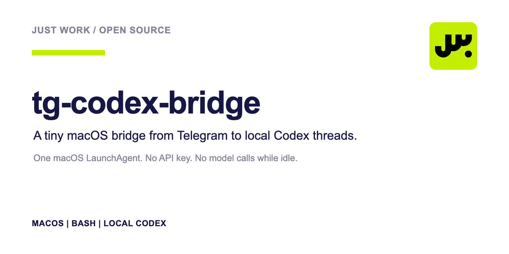

# tg-codex-bridge



A tiny macOS bridge from Telegram chats to existing local Codex threads.

One LaunchAgent. No API key. No model calls while idle.

## Setup

Requires macOS, `jq`, ChatGPT with its bundled Codex CLI, and a Telegram bot token.

```bash
mkdir -p "$HOME/.config/tg-codex-bridge"
install -m 600 /dev/null "$HOME/.config/tg-codex-bridge/.env"
${EDITOR:-vi} "$HOME/.config/tg-codex-bridge/.env"
```

```dotenv
TELEGRAM_BOT_TOKEN=replace-me
```

## Commands

```text
tg-codex-bridge.sh CHAT_ID codex://threads/THREAD_ID
tg-codex-bridge.sh status CHAT_ID
tg-codex-bridge.sh stop CHAT_ID
```

The first command creates or updates one route. `stop` removes that CHAT_ID; the shared listener stops after its last route. Telegram `/help` and `/status` are handled locally without starting Codex.

## Security

- The token file must be owned by the current user, mode `0600`, and not a symlink.
- The token never appears in arguments or the LaunchAgent plist.
- Only configured private chat IDs can start Codex turns.
- Codex keeps its normal local permissions and approvals.

Treat Telegram access as access to the connected Codex threads.

## Test

```bash
/bin/bash tests/test.sh
shellcheck -x -s bash skills/tg-codex-bridge/scripts/tg-codex-bridge.sh tests/test.sh
```

## License

[MIT](LICENSE) © [Just Work](https://just-work.org/)
